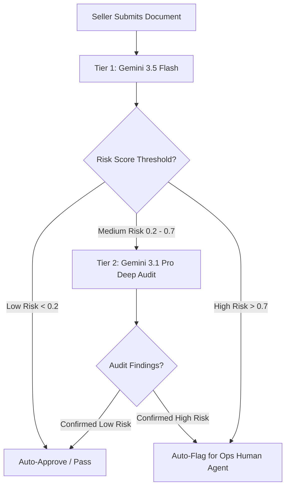

# AI Forgery Document Review - PoC & Hands-on Guide

This directory contains the Proof of Concept (PoC) code and an interactive Jupyter Notebook guide for the **AI Forgery Document Review** project, designed for the Coupang Onboarding & Fraud Prevention teams.

Our goal is to build an intelligent, automated review system to assess whether documents submitted by sellers during onboarding are faked, forged, or altered, and whether they satisfy standard operational requirements.

---

## 🔍 Feasibility Analysis Results

During our feasibility check, we evaluated the four sample forged documents provided by your team using Gemini's multimodal capabilities. The model successfully and accurately caught **100% of the anomalies** with highly descriptive reasoning:

| Sample Document | Detected Anomaly (Ops) | AI Feasibility Analysis & Verification | Forgery Type |
| :--- | :--- | :--- | :--- |
| **[Musinsa Adidas Screenshot](file:///Users/changjoon/Documents/04_Coupang/05_ai_forgery/허위서류%20공유/허위서류%20공유/무신사구매내역서(아디다스).png)** | URL order number does not match page's order number | **Verified:** The URL contains `202512282202550002` (Dec 28, 2025), whereas the page content displays `25.12.08(월)` (Dec 8, 2025) and order number `202512081527490001` (Dec 8). | Client-side HTML modification (Inspect-Element) |
| **[Musinsa National Geographic](file:///Users/changjoon/Documents/04_Coupang/05_ai_forgery/허위서류%20공유/허위서류%20공유/무신사구매내역서(내셔널지오그래픽).png)** | Typo `muslnsa.com` in transaction statement popup URL | **Verified:** The popup window mockup has a typosquatted URL bar showing `muslnsa.com` (lowercase `L` instead of `i`), while the main page shows `musinsa.com`. | Graphic overlay or fake domain spoofing |
| **[Adidas Receipt](file:///Users/changjoon/Documents/04_Coupang/05_ai_forgery/허위서류%20공유/허위서류%20공유/아디다스매장영수증.png)** | Non-existent "Insan" branch; address located in Hanam-si | **Verified:** The header says `(주)예스런던(아디다스 인산점)`. There is no "인산" (Insan) branch (should be 안산 / Ansan). The address is listed as `경기 하남시 미사강변한강로...` which is physically located in Gyeonggi Hanam-si, not Ansan. | Synthetic Receipt Generator |
| **[Hyundai Department Store](file:///Users/changjoon/Documents/04_Coupang/05_ai_forgery/허위서류%20공유/허위서류%20공유/현대백화점%20영수증.png)** | Typo "롱삼" instead of "롱샴" for Longchamp | **Verified:** The item names are listed as `롱삼` (Longsam), which is a spelling mistake for the luxury brand **Longchamp** (transliterated in Korean as `롱샴`). | Synthetic Receipt Generator / manual text edit |

---

## 🛠️ Project Structure

This PoC includes two primary components:

1. **[`forgery_detector.py`](file:///Users/changjoon/Documents/04_Coupang/05_ai_forgery/forgery_detector.py)**: The production-ready forensic detection engine.
   - Uses the **modern official Google GenAI Python SDK**.
   - Enforces a rigorous **JSON schema output** (Pydantic model) mapping exactly to your Ops expectations.
   - Integrates **Programmatic Verification Layers** (such as Korean Business Registration Number validation and mathematical total checking) to supplement the LLM's visual analysis.
2. **[`forgery_detection_poc.ipynb`](file:///Users/changjoon/Documents/04_Coupang/05_ai_forgery/forgery_detection_poc.ipynb)**: An interactive Jupyter Notebook hands-on guide.
   - Guides you through the local setup and package verification.
   - Contains cells to load the sample images, run the models, and visualize the output reports side-by-side with the images.
   - Compares the outputs of **Gemini 3.5 Flash** (cost-efficient) and **Gemini 3.1 Pro** (high-precision audit).

---

## 🚀 Local Hands-on Setup

Follow these simple steps to run the PoC on your local computer:

### 1. Create a Python Virtual Environment

It is highly recommended to isolate your environment using `venv`:

```bash
# Navigate to the workspace
cd /Users/changjoon/Documents/04_Coupang/05_ai_forgery

# Create the virtual environment
python3 -m venv venv

# Activate it
source venv/bin/activate
```

### 2. Install Dependencies

Install the Google GenAI SDK, Pydantic, Pillow, Jupyter, and Matplotlib:

```bash
pip install --upgrade pip
pip install google-genai pydantic pillow matplotlib jupyter notebook
```

### 3. Set your Gemini API Key

Get your API key from Google AI Studio and export it:

```bash
export GEMINI_API_KEY="your_actual_gemini_api_key_here"
```

### 4. Run the Jupyter Notebook

Start Jupyter Notebook to open the interactive hands-on guide:

```bash
jupyter notebook forgery_detection_poc.ipynb
```

*Alternatively, you can run the CLI script directly:*

```bash
python3 forgery_detector.py "허위서류 공유/허위서류 공유/현대백화점 영수증.png" gemini-2.5-flash
```

---

## 🧬 Output JSON Payload Structure

The `forgery_detector.py` engine guarantees that the API returns a structured JSON payload. Below is a breakdown of the fields you can feed directly into your Ops review backend:

| Field Name | Type | Description |
| :--- | :--- | :--- |
| `vendor_name` | `string` | The extracted name of the vendor or store. |
| `is_forged` | `boolean` | Flag indicating if forgery/tampering is detected (`true` or `false`). |
| `forgery_confidence_score`| `float` | A value between `0.0` and `1.0` indicating how confident the model is. |
| `forgery_reasoning` | `array[string]`| Detailed bullet-point list of the specific evidence found. |
| `ai_generation_probability`| `float` | Likelihood that the document was synthetically produced by an AI layout generator. |
| `ai_generation_reasoning`| `array[string]`| Bullet points explaining the AI generation score. |
| `ops_requirements` | `array[object]`| A checklist containing `{requirement_name, fulfilled, details}` for standard compliance. |
| `extracted_metadata` | `object` | Extracted fields such as date, total amount, line items, address, business ID, etc. |

### Example JSON Payload Output:
```json
{
    "vendor_name": "현대백화점",
    "is_forged": true,
    "forgery_confidence_score": 0.98,
    "forgery_reasoning": [
        "The brand name 'Longchamp' is misspelled as '롱삼' (Longsam) throughout the receipt, which is a critical spelling error for a luxury department store brand.",
        "The purchase store location in the footer is printed as '롱삼' rather than a standard branch name."
    ],
    "ai_generation_probability": 0.85,
    "ai_generation_reasoning": [
        "The layout uses a standard synthetic thermal receipt generator font, which is highly clean and lacks typical physical scanning noise or authentic thermal print fading."
    ],
    "ops_requirements": [
        {
            "requirement_name": "brand_spelling_legible",
            "fulfilled": false,
            "details": "Brand name 'Longchamp' is printed incorrectly as '롱삼'."
        },
        {
            "requirement_name": "date_legible",
            "fulfilled": true,
            "details": "Stated purchase date is 2025-05-31 18:32."
        }
    ],
    "extracted_metadata": {
        "date": "2025-05-31 18:32",
        "order_number": "2122-0048",
        "total_amount": "600,000",
        "business_registration_number": "124-85-86989",
        "store_address": "서울 영등포구 여의대로 108",
        "line_items": [
            {"item_name": "롱삼 34175089001", "quantity": 1, "amount": "160,000"},
            {"item_name": "롱삼 L1621089001", "quantity": 1, "amount": "210,000"},
            {"item_name": "롱삼 L2605089001", "quantity": 1, "amount": "230,000"}
        ]
    }
}
```

---

## 📈 Dual-Tiered Production Model Strategy

For deployment in Coupang's high-volume onboarding pipeline, we recommend a **two-tiered architecture**:



1. **Tier 1 (Gemini 3.5 Flash):** Handles 100% of incoming submissions. Fast (~1-2 seconds) and extremely cost-effective. Extracts metadata, validates mathematics, checks for obvious text matches, and filters out clear passes.
2. **Tier 2 (Gemini 3.1 Pro):** Automatically triggered only for suspicious, high-risk, or high-value onboarding submissions. Performs deep visual forgery checking, pixel-level character spacing analysis, and complex semantic alignment checks.
